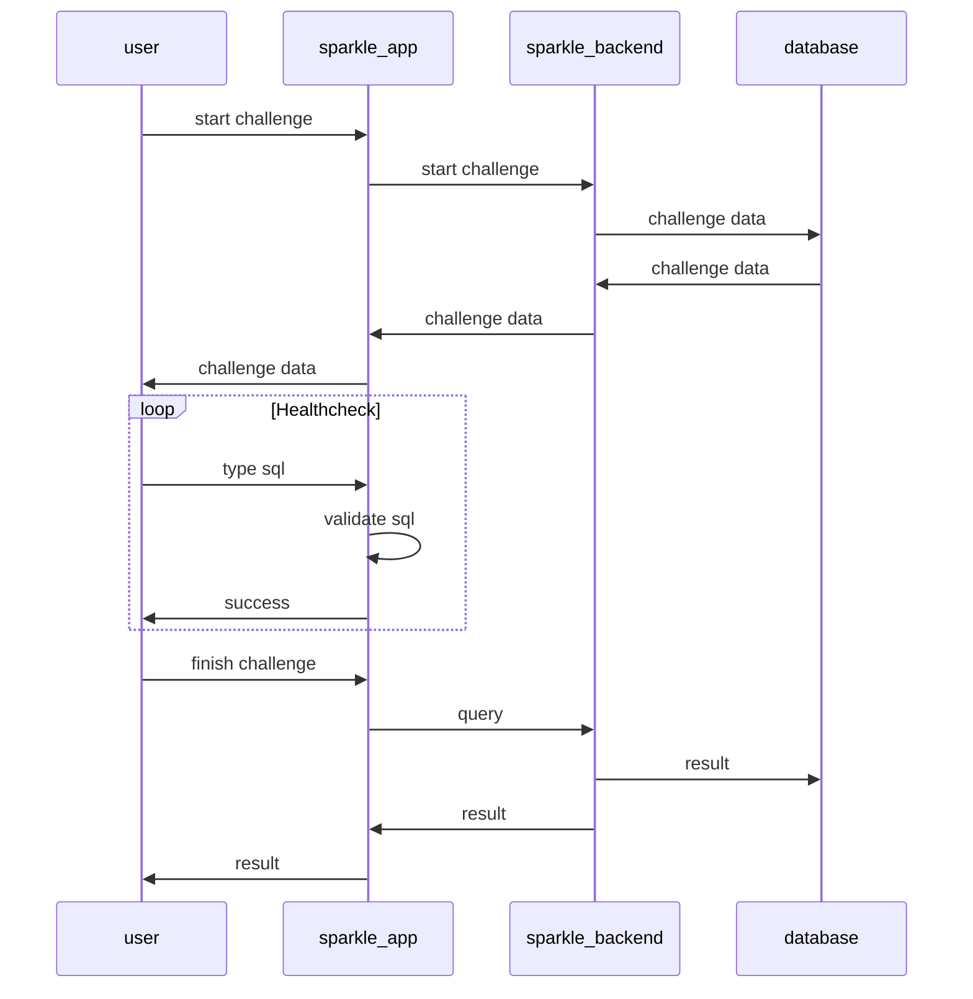

# sparkle - SQL typing game 🐿️

## 1. Introduction

Sparkle is a web application that allows users to practice their SQL skills by typing out queries
against a timer. The application will provide a list of challenges that the user can choose from
and will track their progress over time. The application will also provide a leaderboard to show
the top users and their scores.

## 2. Requirements

- User can sign up and log in to the application using OAuth
- User can start solo or multiplayer challenges
- User can view their progress over time
- User can view the leaderboard to see the top users and their scores
- User can see their statistics

## 3. High Level Design 

Project will be divided into two main parts, the Sparkle App and the Sparkle Backend. The Sparkle App will be a Next.js application that will provide the user interface for the application. The Sparkle Backend will be a Next.js serverless functions that will provide the backend for the application. The backend will have access to the database and will be responsible for handling the challenges and user data. Also backend will also be responsible for validating the SQL queries on the server side.

Diagram below shows the sequence of events when a user starts a challenge.

## 4. Technologies

- Next.js as the frontend and backend framework
- SQLite (Pocketbase) as the database, auth and realtime sync provider (https://pocketbase.io)
- Vercel for deployment
